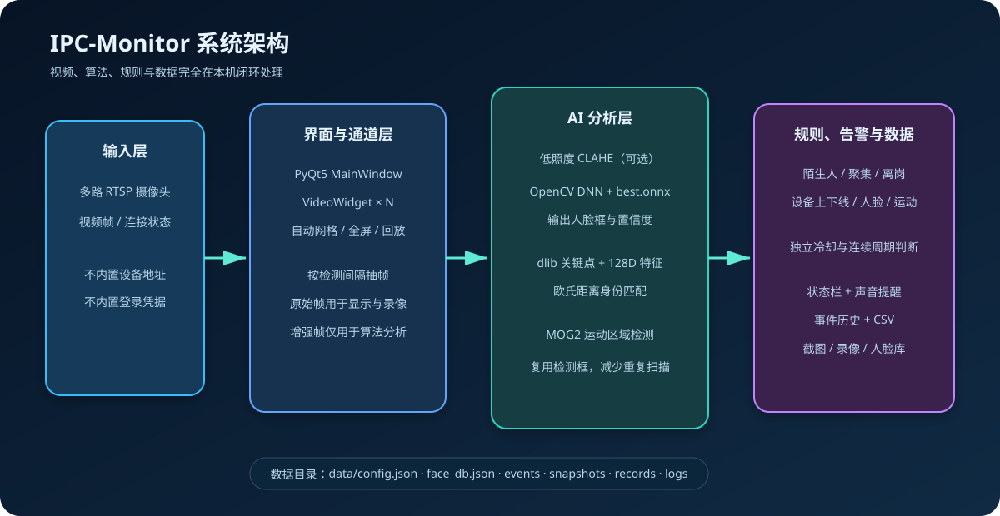
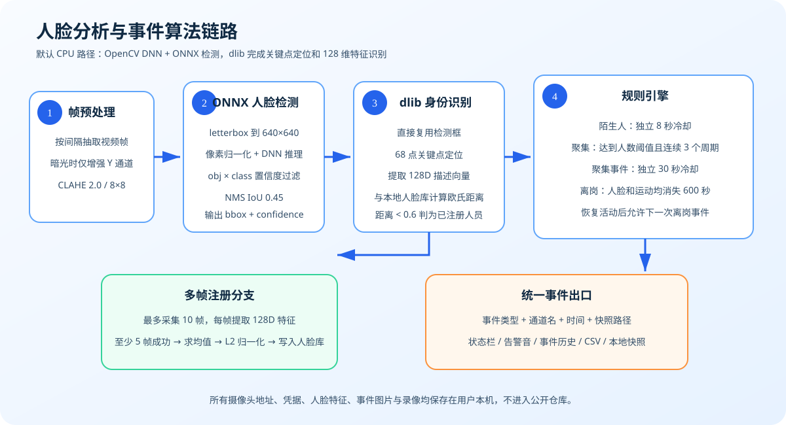

# IPC-Monitor

IPC-Monitor 是一个面向 Windows 的多路 RTSP 摄像头监控与本地人脸分析工具。它提供可视化摄像头管理、自动网格布局、录像回放、事件历史、人脸注册与识别、陌生人告警、人员聚集检测、值守状态检测和低照度增强。

项目采用“视频通道 → 人脸/运动分析 → 事件规则 → 本地告警与留档”的分层结构。默认检测链路使用 OpenCV DNN 直接运行 ONNX 模型，不要求安装 PyTorch；身份识别使用 dlib 的关键点定位和 128 维人脸描述向量。摄像头配置、人脸库、事件图片和录像均只保存在用户本机。

[](LICENSE)
[](https://www.python.org/downloads/)
[](#)

## 主要功能

- 多路 RTSP 视频接入，支持 1×1、2×2、3×3、4×4 自动布局。
- OpenCV DNN + ONNX 人脸检测，默认运行不依赖 PyTorch。
- dlib 128 维人脸特征注册、识别和多帧平均注册。
- 陌生人、人员聚集、设备上下线和离岗事件提醒。
- 手动录像、定时录像、截图、录像回放和事件 CSV 导出。
- 夜间低照度增强、通道全屏和告警静音。
- 源码运行与 PyInstaller 单文件 EXE 两种使用方式。
- 配置、人脸库、日志、截图和录像均保存在本机，不上传外部服务。

## 系统架构



系统分为四个协作层次：

1. **输入层**：每个设备提供 RTSP 视频流和连接状态；仓库不预置设备地址或凭据。
2. **界面与通道层**：`MainWindow` 管理工具栏、布局和统一事件入口，多个 `VideoWidget` 分别负责拉流、显示、检测调度、截图和录像。
3. **AI 分析层**：`FaceEngine` 输出人脸框，`FaceRecognizer` 计算身份特征，`MotionEngine` 检测运动区域。人脸框会直接传给识别器，避免再次全图搜索人脸。
4. **规则与数据层**：陌生人、聚集、离岗和设备状态等规则生成统一事件，再驱动状态栏、告警音、事件历史、CSV、快照和录像。所有数据写入本机 `data/`。

显示/录像使用原始视频帧；低照度增强得到的帧只送入检测流程，因此不会把增强后的偏色画面写入录像。

## 算法链路



### 1. 低照度预处理

在自动模式下，平均亮度低于 50 时启用 CLAHE；也可以从工具栏强制开启。算法先将 BGR 转成 YCrCb，只对 Y 亮度通道执行 `clipLimit=2.0`、`tileGridSize=8×8` 的局部直方图均衡，再恢复为 BGR。这样能改善暗部对比度，同时尽量保留色彩信息。

### 2. ONNX 人脸检测

默认后端将帧等比例 letterbox 到 640×640，以 `1/255` 归一化后交给 OpenCV DNN。模型输出的目标置信度与类别置信度相乘，再按配置的检测阈值过滤；候选框经过 IoU 0.45 的非极大值抑制（NMS），转换回原始画面坐标，过滤小于 20 像素的框，最多保留置信度最高的 10 张人脸。

默认配置每 5 帧执行一次人脸检测和运动检测，非检测帧复用最近结果，从而降低 CPU 占用并保持界面连贯。`best.pt` 和 PyTorch/Ultralytics 路径属于可选实验后端，默认 EXE 使用 `best.onnx`。

### 3. dlib 人脸识别与注册

检测框直接传给 dlib 识别器：68 点关键点模型完成对齐，ResNet 模型生成 128 维描述向量，再与 `data/face_db.json` 中的已注册向量计算欧氏距离。最小距离小于 0.6 时判为已注册人员，否则判为陌生人。

多帧注册最多采集 10 帧，至少需要 5 帧成功提取特征。系统对有效的 128 维向量求均值并再次做 L2 归一化，然后写入本地人脸库，以减小单帧姿态和光照波动的影响。

### 4. 运动与事件规则

- **运动检测**：MOG2 背景建模提取前景区域，默认忽略面积小于 1500 像素的区域。
- **陌生人事件**：识别距离未通过阈值时生成事件；单通道采用独立 8 秒冷却，避免连续告警。
- **人员聚集**：同一画面达到人数阈值并连续满足 3 个检测周期才触发，事件采用独立 30 秒冷却。人数阈值由通道配置决定。
- **离岗检测**：仅对标记为值守岗的通道启用；连续 600 秒既无人脸也无运动时触发一次，检测到活动后重置状态。

这些规则最终都进入 `MainWindow` 的统一事件处理路径，形成类型、通道、时间和快照等记录，并按设置触发声音与状态提示。

## 直接运行 EXE

1. 打开仓库的 [Releases](https://github.com/sun2006-xin/ipc-monitor/releases) 页面。
2. 下载最新的 `IPC-Monitor-windows-x64.zip`。
3. 解压到可写目录，不要直接在压缩包内运行。
4. 双击 `IPC-Monitor.exe`。
5. 首次启动后通过“添加设备”填写自己的摄像头连接信息。

程序不会附带任何默认摄像头、IP 地址或登录凭据。运行时数据会写入 EXE 同级的 `data/` 目录。

## 从源码运行

环境要求：Windows 10/11、Python 3.11。

```powershell
git clone https://github.com/sun2006-xin/ipc-monitor.git
cd ipc-monitor
python -m venv .venv
.\.venv\Scripts\Activate.ps1
python -m pip install --upgrade pip
python -m pip install -r requirements.txt
python main.py
```

Windows 用户也可以在安装依赖后双击 `run.bat`。

默认检测后端使用 `best.onnx` 和 OpenCV DNN。只有需要实验 PyTorch/Ultralytics 后端时，才安装可选依赖：

```powershell
python -m pip install -r requirements-optional-yolo.txt
```

## 摄像头配置

程序首次启动时设备列表为空。请在界面中添加设备，并填写：

- 设备名称
- 摄像头主机地址
- RTSP 端口
- 用户名与密码
- 视频流路径

真实配置保存在 `data/config.json`，该文件已被 `.gitignore` 排除。请勿将真实配置、人脸数据、截图、录像或日志提交到公开仓库。

## 项目结构

```text
ipc-monitor/
├─ main.py                       程序入口与崩溃日志保护
├─ run.bat                       源码双击启动器
├─ build_exe.ps1                 Windows EXE 构建与自测
├─ build_exe.bat                 构建脚本入口
├─ core/
│  ├─ app_paths.py               源码/EXE 资源与用户数据路径
│  ├─ config_manager.py          本地配置和 RTSP 地址构造
│  ├─ face_engine.py             ONNX 人脸检测
│  ├─ face_recognizer.py         dlib 人脸特征与识别
│  ├─ motion_detector.py         运动检测
│  └─ event_logger.py            事件记录
├─ ui/                           PyQt5 界面与视频通道组件
├─ models/                       dlib 模型
├─ best.onnx                     默认人脸检测模型
├─ best.pt                       可选 PyTorch 检测模型
├─ resources/                    翻译与告警音资源
├─ data/                         本地运行数据目录
└─ tests/                        路径、ONNX 和发布隐私测试
```

## 构建 Windows EXE

```powershell
powershell -NoProfile -ExecutionPolicy Bypass -File .\build_exe.ps1
```

构建流程会：

1. 生成控制台版并执行启动自测。
2. 检查 ONNX 后端是否成功加载且没有致命错误。
3. 生成最终无控制台窗口版 `dist\IPC-Monitor.exe`。

构建脚本不会打包 `data/` 中的用户配置、人脸数据、截图、录像或日志。

## 本地测试

```powershell
python -m unittest discover -s tests -v
python -m compileall -q core ui main.py tests
```

## 常见问题

### 程序无法连接摄像头

- 确认摄像头已启用 RTSP。
- 确认主机地址、端口、账号、密码和流路径正确。
- 确认电脑可以访问摄像头所在网络。
- 查看 `data/logs/` 中的日志，但不要公开包含设备信息的日志文件。

### EXE 启动后没有设备

这是预期行为。为保护隐私，发布包不包含默认摄像头配置，请手动添加设备。

### dlib 安装失败

请使用 Python 3.11，并优先安装与当前 Python 版本和系统架构匹配的预编译 wheel。源码编译 dlib 需要 Visual Studio C++ Build Tools 和 CMake。

## 隐私与安全

- 仓库和发布包不包含真实摄像头地址、密码或作者本机配置。
- RTSP 地址写入日志前会隐藏密码。
- 用户数据只保存在本地 `data/` 目录。
- 发布前会检查暂存文件中的私网地址、带凭据 URL、密钥和令牌模式。
- 如果敏感信息曾经进入公开提交，仅删除当前文件并不足够；应立即更换凭据，并单独处理 Git 历史。

## License

本项目采用 [Apache License 2.0](LICENSE)。第三方模型和依赖仍受其各自许可证约束。

## 致谢

- [OpenCV](https://opencv.org/)
- [dlib](http://dlib.net/)
- [PyQt](https://www.riverbankcomputing.com/software/pyqt/)
- [Ultralytics](https://github.com/ultralytics/ultralytics)
