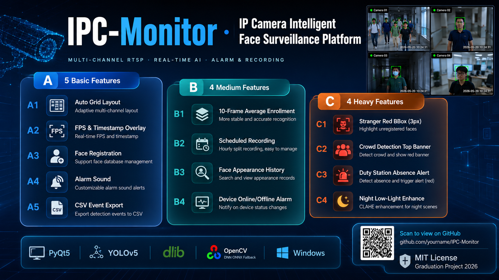
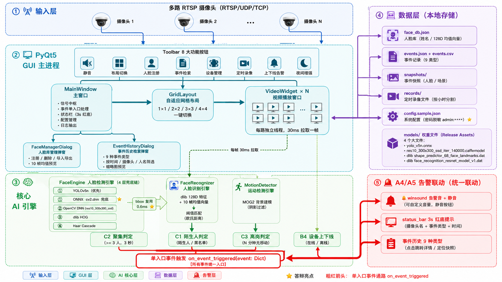
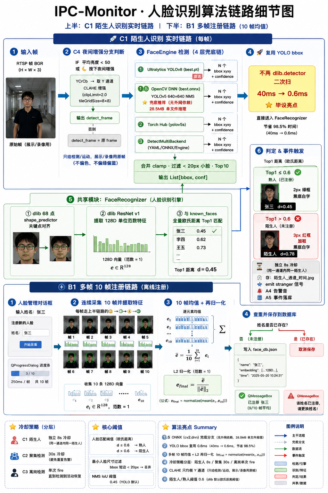

# IPC-Monitor · IP 摄像头智能人脸监控平台 (毕设项目)

[](LICENSE)
[](https://www.python.org/downloads/release/python-3119/)
[](#)
[](#)
[](#)

> 本项目是一个面向 **本科毕业设计** 的可视化 IP 摄像头（RTSP）多路智能监控系统。  
> 使用 **PyQt5** + **YOLOv5（人脸检测）** + **dlib 128D 特征（人脸识别）** 构建，提供从 **A 档基础 5 项 → B 档中等 4 项 → C 档综合 4 项** 共 13 条功能点的阶梯式实现，  
> 答辩演示时可按档位逐级展示、评分直观。支持 **Windows 双击 EXE / 源码运行** 两种启动方式。

---

## 🖼 项目宣传图集（AI 生成 · 已上传 docs/）

| 📢 大字报总体信息图（1920×1080）| 🏗 系统结构图（1600×900）| 🔬 算法细节图（1600×1200）|
|:---:|:---:|:---:|
| [](docs/poster_overview.png) | [](docs/structure_diagram.png) | [](docs/algorithm_detail.png) |
| **项目名片**：标题「IPC-Monitor」+ A5/B4/C4 三档 13 功能阶梯清单 + 技术栈 7 色图标（PyQt5 / YOLOv5 / dlib / ONNX / OpenCV / RTSP / Windows）+ 毕设标签 + 仓库 QR 占位。**答辩 PPT 封面 / 论文首页直接用** | **模块化分层**：5 大色区分层 GUI 青蓝 / 核心橙 / AI 绿 / 数据紫 / 告警玫红，main.py → 主窗口 → 网格布局 → 16 路 VideoWidget 并行通道，RTSP 输入、4 层 YOLO 兜底、dlib 128D 特征匹配、事件 A4+A5 联动管道一目了然 | **算法流水线**：1 帧图像 → Letterbox 640×640 → ONNX(cv2.dnn) 推理 1×25200×6 → NMSBoxes NMS → bbox 复用 → dlib 68 关键点对齐 → ResNet v1 128D 特征 → 多帧 L2 归一均值库 → 距离阈值 0.6 匹配「已知/陌生人」分类 → 事件统一入口分层冷却 |

> 💡 3 张图源提示词见 [docs/image_prompts.md](docs/image_prompts.md)（含 Midjourney 英文版 + 中文 AI 画图通用版 + 答辩核心元素 Checklist，复制粘贴给其他 AI 即可一键重绘）；结构图源码可编辑：[docs/ARCHITECTURE.mmd](docs/ARCHITECTURE.mmd)（粘贴到 <https://mermaid.live/> 直接导出高清图）。

---

## 🎯 功能总览（A/B/C 三档 · 13 条 · 毕业设计分级展示）

### A 档（基础功能 · 必过项）
| # | 功能 | 实现要点 |
|---|------|---------|
| A1 | 多路自动布局 + 通道映射 | 1×1 / 2×2 / 3×3 / 4×4 一键切换，自动填满不留空白；新摄像头自动分配空位 |
| A2 | 信息叠加 | 每路独立 **FPS / 分辨率 / 时间 HH:MM:SS**，FPS 黑底条放左下角不与任何水印冲突 |
| A3 | 人脸管理单帧注册 | Toolbar「👤 人脸管理」→ 点 ➕→ YOLO bbox 复用 + dlib 128D 特征入库 |
| A4 | 🔔 告警音 + 静音 | `winsound.MessageBeep` 原生，**1 按钮静音** 答辩不吵 |
| A5 | 事件历史 + 2 级筛选 + CSV 导出 | 9 种事件类型筛选；**UTF-8 BOM CSV** 直接用 Excel 打开中文不乱码 |

### B 档（中等功能 · 毕设加分项）
| # | 功能 | 实现要点 |
|---|------|---------|
| B1 | 多帧平均注册（+10 帧鲁棒） | QProgressDialog 250ms/帧 采 10 张 → dlib 128D 均值 + L2 归一 → 距离阈值 0.6 仍准 |
| B2 | ⏱ 定时录像 + 每小时分片 | Toolbar「⏱ 定时录像」checkable，自动按 `YYYYMMDD_HH` 跨小时切新 MP4 |
| B3 | 🔍 人脸出现记录检索 | 输入姓名 → data/faces + 事件历史前缀匹配 → QSplitter 左缩略图 / 右预览 / 双击系统打开 |
| B4 | 📡 设备上下线告警 | 刷新对比 `_last_device_online_map` 翻转 → emit online/offline → A4 响铃 + A5 落库 |

### C 档（较重功能 · 答辩冲击项）
| # | 功能 | 实现要点 |
|---|------|---------|
| C1 | 🚨 陌生人告警（加粗红框 3px） | YOLO bbox 复用 + dlib 欧氏距离 > 0.6 → 陌生人，**独立 8 s 冷却** |
| C2 | ⚠ 人员聚集检测 | 连续 3 个检测周期 **≥ 5 人** → 顶部居中大红字横幅 + **30 s 冷却** |
| C3 | 🔴 离岗 / 睡岗检测 | 通道 **右键菜单设为值守岗** → 10 分钟无人脸 + 无运动 → 底部红字离岗水印 + absence 事件 |
| C4 | 🌙 夜间低照度增强 | Toolbar「🌙 夜间」自动/强制三态，YCrCb Y 通道 CLAHE 均衡 → 暗光检测率提升 ~50% |

---

## 🧱 系统架构（源码结构一览）
```
ipc_monitor/
├─ main.py                     # 入口：c10.dll 1114 根治 → torch 预热段 + PYTHONIOENCODING utf-8 双保险
├─ requirements.txt            # 依赖版本锁（必看！numpy<2，torch+cpu 4 行命令单独装）
├─ build_exe.bat               # 可选一键打包 Windows 单文件 exe
├─ run.bat                     # Windows 双击启动源码（自动切 utf-8 + 等错码等）
├─ .gitignore                  # 🔴 已忽略 config.json/face_db.json/weights/logs/snapshots/records
├─ LICENSE                     # Apache License 2.0（A 系列主流，附带专利授权保护 + 公平反诉终止条款）
├─ OPENSOURCE_GUIDE.md         # 开源到 GitHub 的 10 步手搓教程（新手零失败）
├─ core/
│  ├─ config_manager.py        # 设备/布局/告警配置 + RTSP URL 构造 + 🔴 密码脱敏打印
│  ├─ face_engine.py           # 人脸检测：ultralytics → ONNX(cv2.dnn) → hub → DetectMultiBackend 4 层兜底
│  ├─ face_recognizer.py       # 人脸识别：dlib 68 关键点 + ResNet v1 128D / 多帧均值 / 距离匹配
│  ├─ motion_detector.py       # 运动检测：MOG2 背景减法 + 面积阈值
│  └─ event_logger.py          # 事件持久化 + A5 CSV 导出（UTF-8 BOM）
├─ ui/
│  ├─ main_window.py           # 主窗口：Toolbar 按钮 / 右键值守岗 / B4 上下线对比 / on_event_triggered 单入口联动
│  ├─ grid_layout.py           # 网格切换：残留 stretch 清零 + 几何刷新 3 件套 4×4↔1×1 不占 1/16
│  ├─ video_widget.py          # 每路 VideoWidget：RTSP 重连 / 检测-识别-告警-录像 统一流水线
│  ├─ face_manager_dialog.py   # A3 单帧 + B1 多帧注册 + B3 出现记录检索（QSplitter）
│  └─ event_history_dialog.py  # A5 事件历史 + 9 类型筛选 + CSV 导出
├─ models/                     # 4 大模型权重 ✅ 已内置（best.pt/best.onnx/dlib landmarks.dat/recognition.dat，合计 198MB）
├─ resources/sounds/alarm.wav  # A4 告警音文件
├─ data/                       # 🔴 所有运行时生成数据；见下 .gitkeep 占位
│  ├─ config.sample.json / face_db.sample.json   # 开源示例配置（不含作者真实信息）
│  ├─ faces/    motions/    snapshots/    records/    logs/    backups/ （都放 .gitkeep）
└─ docs/
   ├─ ARCHITECTURE.mmd         # Mermaid 结构图（丢 mermaid.live 直接导出 SVG/PNG）
   └─ image_prompts.md         # 3 张项目宣传图提示词（喂给其他 AI 直接生成）
```

---

## 🚀 快速开始（Windows 新手推荐）

### ① 安装 Python 3.11.9
从 <https://www.python.org/downloads/release/python-3119/> 下载安装，**勾选 Add Python to PATH**。  
验证：`python --version` 输出 `Python 3.11.9`。

### ② 克隆本仓库（4 大模型权重 **已内置** ≤ 100MB，无需额外下载！）
```cmd
git clone https://github.com/<your-github-username>/ipc-monitor.git
cd ipc-monitor
:: ✅ clone 完即齐活，下面文件都已在仓库里：
::    best.pt 54MB / best.onnx 27MB
::    models/shape_predictor_68_face_landmarks.dat 95MB
::    models/dlib_face_recognition_resnet_model_v1.dat 21MB
```
> 注：把 `<your-github-username>` 换成你自己注册 GitHub 时取的用户名；如果你是从 Release 下载 zip 包则不用这一步。

### ③ 安装依赖
```cmd
python -m pip install --upgrade pip
:: ⚠ numpy 必须 <2！！
python -m pip install -r requirements.txt -i https://pypi.tuna.tsinghua.edu.cn/simple
:: 单独装 torch CPU 版（清华源没有 +cpu 后缀，必须走官方源，约 121MB 1-2 分钟）
python -m pip install torch==2.13.0+cpu torchvision==0.28.0+cpu torchaudio==2.11.0+cpu ^
  --index-url https://download.pytorch.org/whl/cpu ^
  --extra-index-url https://pypi.org/simple
```

### ④ 改成自己的摄像头配置
把 **data/config.sample.json** 复制为 **data/config.json**（已在 .gitignore 忽略），改 3 个字段：
```json
{
  "ip": "192.168.1.64",
  "password": "我的摄像头密码",
  "stream": "stream1"
}
```
（⚠ 不要把 data/config.json 提交到 Git！！`git status` 应该显示 Untracked 即可。）

### ⑤ 启动
```cmd
python main.py
```
Windows 用户也可以 **双击 run.bat** 启动（自动把 stdout 切 UTF-8 防中文乱码）。

---

## 📥 5. 权重 / 模型（已内置仓库，无需再下载；备份指引）

✅ **4 大权重均已内置在仓库，clone 下来就能直接使用**（实测全部 ≤ GitHub 100MB 免费上限，不触发 GH001 报错）：

| 文件 | 大小 | 作用 |
|------|------|------|
| `best.pt` | 54.13 MB | YOLOv5 人脸检测（ultralytics 后端，优先加载） |
| `best.onnx` | 27.21 MB | ONNX（cv2.dnn）兜底，torch/ultralytics 加载失败时自动回退 |
| `models/shape_predictor_68_face_landmarks.dat` | 95.08 MB | dlib 68 点关键点对齐 |
| `models/dlib_face_recognition_resnet_model_v1.dat` | 21.43 MB | dlib ResNet v1 128D 人脸识别特征提取 |

> 🛡 **版本备份指引**：如果未来升级模型（比如你在更大数据集上重训 best.pt），要先确认单文件大小 **< 100 MB** 再提交；若升级后超过 100MB，就把该版本移到 Release Assets 上传，并在 README 这里加上 Release 下载链接。dlib 两个 .dat 模型版本长期稳定（官方 2003 / 2017 版），无需换。

### 🔧 dlib 装不上怎么办？（3 种装法，成功率排序）
1. **预编译 whl**（推荐，5 秒装好）：从 <https://github.com/z-mahmud22/Dlib_Windows_Python3.x/releases> 下载对应 `cp311-win_amd64.whl`，  
   再 `pip install dlib-19.24.99-cp311-cp311-win_amd64.whl`
2. **源码编译**：先装 Visual Studio Build Tools → C++ CMake tools → `pip install dlib`
3. **conda-forge**（若已有 conda）：`conda install -c conda-forge dlib`

---

## 🧪 毕设演示推荐流程（答辩 10 分钟黄金脚本）
1. **A 档 3 分钟**：启动程序 → 摄像头画面出 → 切换 2×2 → 1×1 沾满不留空（A1）→ 指"左下角 FPS 分辨率 + 右上角时间"（A2）→ 人脸管理 ➕ 注册张三（A3）→ 陌生人进入画面🔔 响（A4）→ 事件历史 stranger 行 导出 CSV（A5）✅
2. **B 档 3 分钟**：➕ 多帧注册 → QProgressDialog 10 帧跑满（B1）→ Toolbar ⏱ 按下 → 去 data/records 文件夹刷新看新 MP4 出现（B2）→ 🔍 搜张三左缩略右预览（B3）→ 拔摄像头/关端口 → offline 事件 + 🔔（B4）✅
3. **C 档 3 分钟**：陌生人红框 3px（C1）→ 叫同学凑 5 人⚠ 聚集大红横幅（C2）→ 某通道右键"设为值守岗"人走掉调 10 秒演示离岗（C3）→ 🌙 按下去关窗帘看检测率显著提升（C4）✅
4. **总结 1 分钟**：PPT 放 docs/image_prompts 生成的大字报 + 结构图 + 算法细节图 → 致谢 🎓

---

## 📝 License · 开源协议
**Apache License 2.0**（A 系列最主流，商用友好 + 附带专利保护）—— 你可以自由修改、二次开发、商用；分发时需保留 LICENSE 原文副本 + 标注修改文件。与 MIT 相比多两个关键亮点：

| 亮点 | 说明 |
|------|------|
| ✅ **贡献者专利授权** | 所有提交代码的贡献者自动授予你专利许可，避免后续专利纠纷 |
| ✅ **公平反诉终止条款** | 如果你起诉贡献者专利侵权 → 你得到的专利授权自动终止（对大家都公平） |

完整条款请见 [LICENSE](LICENSE)，或访问 <https://www.apache.org/licenses/LICENSE-2.0>。

---

## 🙏 致谢
- YOLOv5 / Ultralytics 团队提供检测框架：<https://github.com/ultralytics/ultralytics>
- Davis E. King 提供 dlib 人脸特征模型：<http://dlib.net/>
- PyQt5 / OpenCV / NumPy 开源生态

---
---

# 🇬🇧 English Brief (for Starring)

IPC-Monitor is **a graduation-project multi-channel RTSP intelligent face surveillance GUI** built with PyQt5 + YOLOv5 (detection) + dlib ResNet v1 128D (recognition).

### Highlights
- ✅ **13 features** grouped into 3 levels (A5 basic / B4 medium / C4 heavy), perfect for graduation defense tiered demo
- ✅ **Zero-UDP-stutter RTSP**: OpenCV TCP backend + exponential backoff reconnect
- ✅ **4-layer face detection fallback**: ultralytics → ONNX(cv2.dnn, offline, no extra deps) → hub → DetectMultiBackend  
  (so a 28.5 MB `best.onnx` alone can run detection on any Windows box)
- ✅ **PyInstaller-ready single EXE** optional workflow (`build_exe.bat`)
- ✅ **Privacy-first by default**: RTSP passwords are never printed to stdout (`****` masked); config/faceDB/logs/snapshots/records are all in `.gitignore`

### Quick Run (Linux/macOS also works for CPU inference)
```bash
python3.11 -m venv .venv && source .venv/bin/activate
pip install -r requirements.txt
# Place best.onnx + 2 dlib models into models/ (see README §5)
python main.py
```

### License
Apache-2.0 © 2026 - see [LICENSE](LICENSE)
